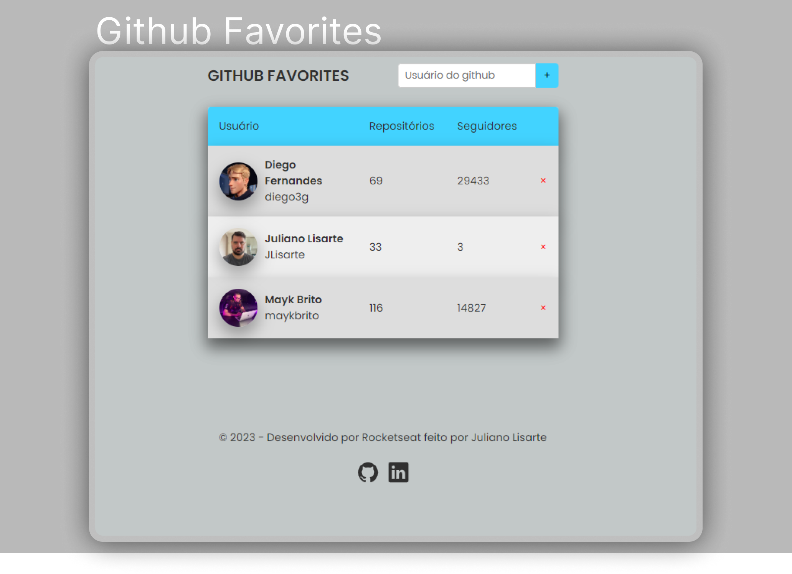

  

<h1 align="center">Github Favorites - Projeto do Explorer - Rocketseat</h1>

 

  
  <a href="https://jlisarte.github.io/projeto_githubFavorites/" target="_blank">https://jlisarte.github.io/projeto_githubFavorites/</a>

## 🚀 Tecnologias

Esse projeto foi desenvolvido com as seguintes tecnologias:

- HTML, CSS e JavaScript
- Git e Github
- Figma

## 💻 Projeto

Github Favorites  
O projeto é um site desenvolvido em Javascript.  
O que foi abordado nesse projeto:

- API;
- LocalStorage;
- Mapeamento de rotas;
- Assíncrono e promises;
- Orientação a objetos;
- Classes;
- Async, Await;

Projeto do Explorer - Rocketseat

---

Feito por Shadowkhan - Juliano Lisarte
